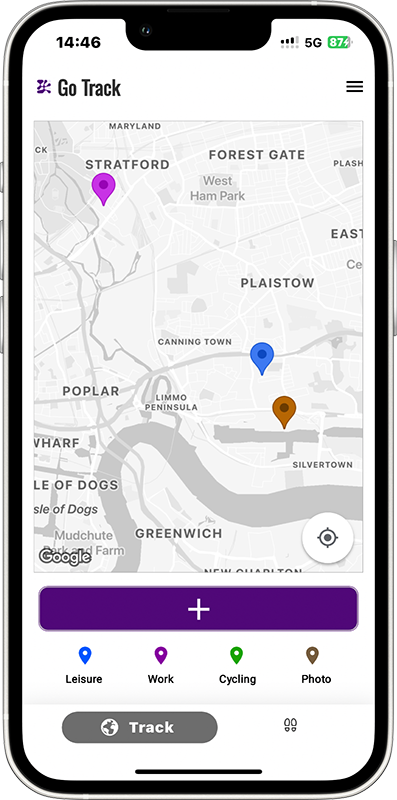
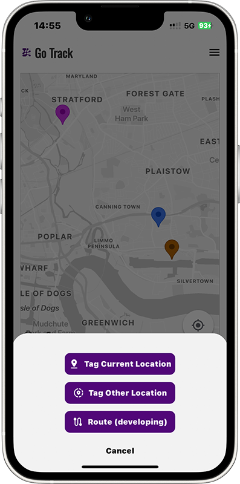
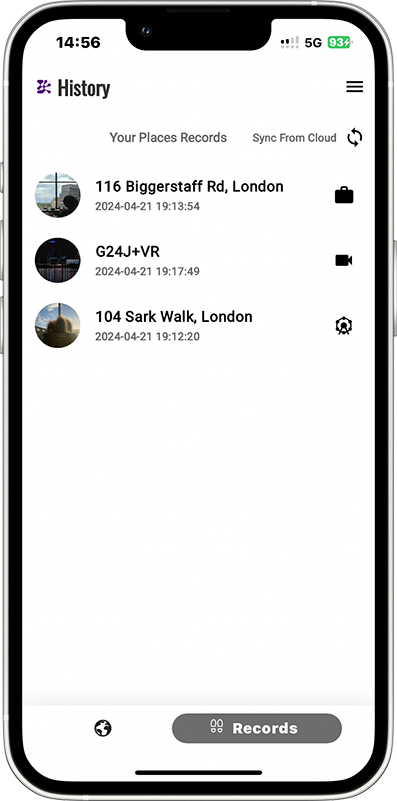
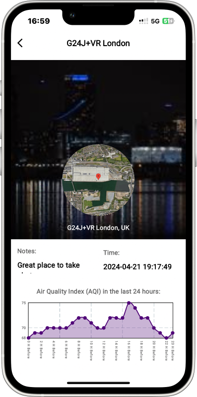

# GeoTracker

**GeoTracker** is an application designed to provide a platform for people to interact with geographic information in our daily activities. Enhance your interaction with the world aroundthrough detailed environmental data and personal annotations.

Check the [LandingPage](https://tianming-liu.github.io/CASA0015-Mobile-System/) to know more about GeoTracker features.

 

      

 

**Not just data**, GeoTracker enables you to personalize your environmental interaction. Annotate any location on the planet with real-time notes and images, capturing your moments and thoughts precisely where and when they happen.

  

Crafted for clarity and ease of use, GeoTracker’s modern UI design puts the information you need at your fingertips. Our interface harmonizes with your environmental exploration, delivering both the depth of data and the simplicity of design.

## Features

- **Personal Annotation**: With GeoTracker, you can mark any location on the planet with notes and images. Whether you're documenting your travels or making note of local environmental conditions, GeoTracker makes it easy.

- **Environmental Data Tracking**: GeoTracker records the past 24 hours of Air Quality Data, retrieved via Google API, for your referenced location. Annotate your map with environmental insights and contribute to a healthier planet.

- **Cross-Device Data Access**: Your annotated data is securely stored both locally and on the cloud with Google Firebase, allowing for reliable access across multiple devices.

## Installation

Get started with GeoTracker and transform the way you interact with your environment today.

**For Android Users:**
GeoTracker is just a click away. Head over to our [GitHub Releases page](https://github.com/Tianming-Liu/CASA0015-Mobile-System/releases) to find the latest version of the app. Download the `.apk` file and follow the standard installation process for Android apps to begin your journey with GeoTracker.

**For iOS Users:**
We're crafting an exceptional GeoTracker experience for you. The iOS version is currently in development, and we're working hard to bring it to your Apple devices. Stay tuned for updates and release announcements!

Remember to check the [releases](https://github.com/Tianming-Liu/CASA0015-Mobile-System/releases) regularly for new updates, enhancements, and features as we continually improve GeoTracker.

## Dependencies

GeoTracker is built with a number of open-source frameworks and libraries. Below are the links to these resources that power our app:

- [Google Maps for Flutter](https://pub.dev/packages/google_maps_flutter): A Flutter plugin for integrating Google Maps in iOS and Android applications.
- [Location](https://pub.dev/packages/location): A plugin for getting the current location on Android and iOS.
- [Firebase Core](https://pub.dev/packages/firebase_core): A Flutter plugin to use the Firebase Core API, which enables connecting to multiple Firebase apps.
- [Firebase Auth](https://pub.dev/packages/firebase_auth): A Flutter plugin for using the Firebase Authentication API.
- [Firebase Storage](https://pub.dev/packages/firebase_storage): A Flutter plugin to use the Firebase Cloud Storage API.
- [Image Picker](https://pub.dev/packages/image_picker): A Flutter plugin for iOS and Android for picking images from the image library.
- [Cloud Firestore](https://pub.dev/packages/cloud_firestore): A Flutter plugin to use the Cloud Firestore API.
- [Google Navigation Bar](https://pub.dev/packages/google_nav_bar): A modern google style nav bar for flutter.
- [Flutter Riverpod](https://pub.dev/packages/flutter_riverpod): A reactive state-management library that allows building complex applications easily.
- [HTTP](https://pub.dev/packages/http): A composable, Future-based library for making HTTP requests.
- [Flutter Dotenv](https://pub.dev/packages/flutter_dotenv): A Flutter plugin for loading environment variables.
- [SQFLite](https://pub.dev/packages/sqflite): A SQLite plugin for Flutter. Supports iOS, Android, and MacOS.
- [FL Chart](https://pub.dev/packages/fl_chart): A library to draw fantastic charts in Flutter.

For complete information on all the dependencies and their versions, see the `pubspec.yaml` file in the geotracker folder.

##  Contact Details

I'd love to collaborate with app users to make GeoTracker even better for everyone. Whether you have ideas for new features, suggestions for improvements, or want to contribute to the project, i'm eager to hear from you.

Here's how you can reach me:

**Email:** [liutm0086@gmail.com](mailto:liutm0086@gmail.com)  

If you're reporting an issue, please include as much detail as possible. Screenshots, the version of the app you're using, and the type of device can all be very helpful in resolving issues quickly.

GeoTracker is a project developed with ❤️ and dedication. Your involvement makes it even better! Thank you for being a part of the GeoTracker community!
